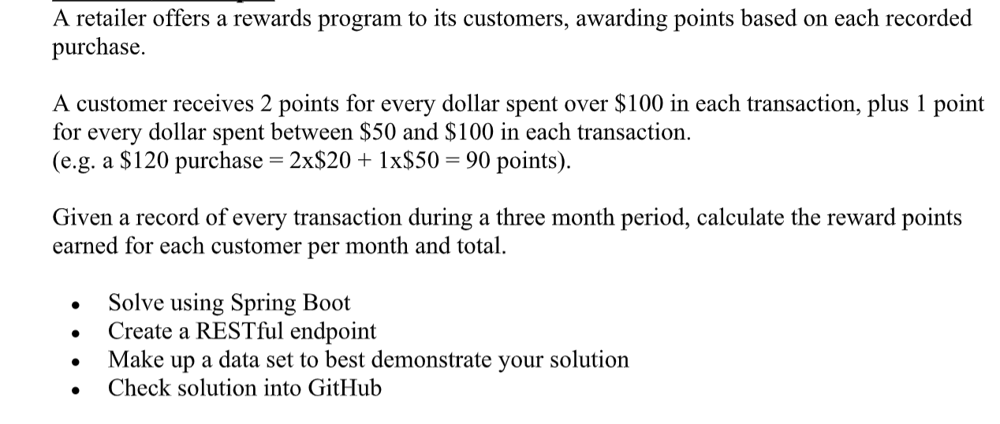

<strong>Business Requirements:</strong> 

<em>Image 1: Assessment requirements provided by company.</em>

<strong>Assumptions with Reasoning:</strong> 
 

#1 This application is written dynamically to accept any number of months; the current dataset is 3 months as required. 

#2 This application will award points for purchases between 50-100$, despite the customer not spending more than 100$. 

&quot;A customer receives 2 points for every dollar spent over $100 in each transaction, plus 1 point for every dollar spent between $50 and $100 in each transaction.&quot; <strong>(this provides no indication that customers should be rewarded points for spending less than 100$)</strong> 

&quot;Given a record of every transaction during a three month period, calculate the reward points earned for each customer per month and total.&quot; <strong>(this provides indication that the dataset will contain exactly 3 months worth of data, therefore no filtering is performed on SQL query for greater performance)</strong>

<strong>Datasource:</strong> 
&nbsp; &nbsp; H2 Embedded Database

<strong>Database web GUI Access:</strong> 
&nbsp; &nbsp; http://localhost:8080/h2-console 
&nbsp; &nbsp; Driver - org.h2.Driver 
&nbsp; &nbsp; JDBC URL - jdbc:h2:mem:dataSetDB 
&nbsp; &nbsp; Username - embeddedDB 
&nbsp; &nbsp; Password - embeddedPassword

<strong>Mock Data</strong> 

&nbsp; &nbsp; 16 records are located within data.sql file. ** Optionally, thousands of more records can be generated via the RandomDataGenerator class. Just change the local variable &#39;number of records&#39; and &#39;number of customers&#39; to any number desired. 

&nbsp;

<em>Image 2: Data set created for project. Embedded database Select *. Schema created during connection to datasource.Table created on initalization of project via JPA entities. Data loaded on initalization of project via data.sql</em>
&nbsp;

<strong>Unit Tests:</strong> 
&nbsp; &nbsp; Currently 80%, can be expanded upon/p&gt;

<strong>Performance:</strong> 
&nbsp; &nbsp; Hashmap o(1)

<strong>API Endpoints:</strong> 
&nbsp; &nbsp; GET http://localhost:8080/customer/points

<strong>Sample Response:</strong>

<em>Image 3: Example of payload response to web api endpoint. No month indicated if no purchases occured during that month. 
Month has a 0 and is present if purchases were made during that month, but no purchases exceeded 51$, i.e. no points awarded.</em>
&nbsp;

<strong>Future expansion on code:</strong>

&nbsp; &nbsp; Increase unit coverage to 100%. Add logging per company requirements. Create global exception handler.

